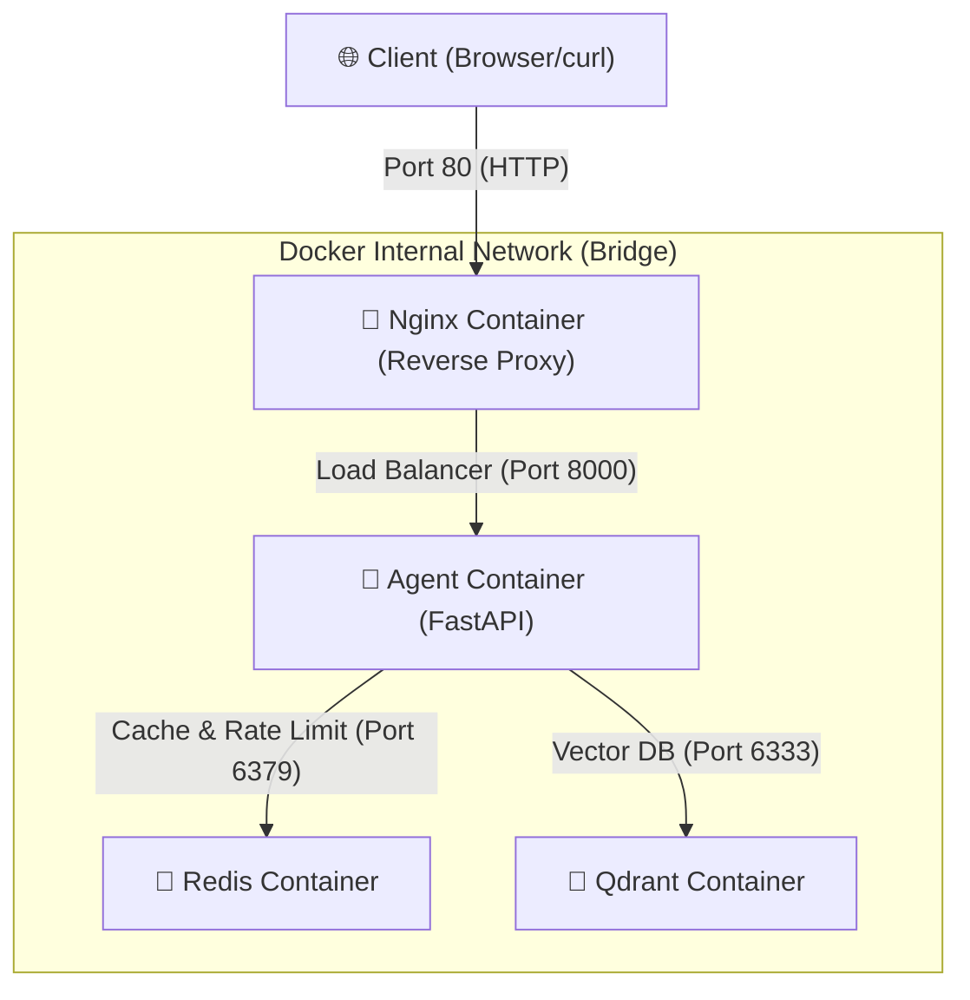

#  Code Lab: Deploy Your AI Agent to Production

> **AICB-P1 · VinUniversity 2026**  
> Thời gian: 3-4 giờ | Độ khó: Intermediate

##  Mục Tiêu

Sau khi hoàn thành lab này, bạn sẽ:
- Hiểu sự khác biệt giữa development và production
- Containerize một AI agent với Docker
- Deploy agent lên cloud platform
- Bảo mật API với authentication và rate limiting
- Thiết kế hệ thống có khả năng scale và reliable

---

##  Yêu Cầu

```bash
 Python 3.11+
 Docker & Docker Compose
 Git
 Text editor (VS Code khuyến nghị)
 Terminal/Command line
```

**Không cần:**
-  OpenAI API key (dùng mock LLM)
-  Credit card
-  Kinh nghiệm DevOps trước đó

---

##  Lộ Trình Lab

| Phần | Thời gian | Nội dung |
|------|-----------|----------|
| **Part 1** | 30 phút | Localhost vs Production |
| **Part 2** | 45 phút | Docker Containerization |
| **Part 3** | 45 phút | Cloud Deployment |
| **Part 4** | 40 phút | API Security |
| **Part 5** | 40 phút | Scaling & Reliability |
| **Part 6** | 60 phút | Final Project |

---

## Part 1: Localhost vs Production (30 phút)

###  Concepts

**Vấn đề:** "It works on my machine" — code chạy tốt trên laptop nhưng fail khi deploy.

**Nguyên nhân:**
- Hardcoded secrets
- Khác biệt về environment (Python version, OS, dependencies)
- Không có health checks
- Config không linh hoạt

**Giải pháp:** 12-Factor App principles

###  Exercise 1.1: Phát hiện anti-patterns

```bash
cd 01-localhost-vs-production/develop
```

**Nhiệm vụ:** Đọc `app.py` và tìm ít nhất 5 vấn đề.

<details>
<summary> Gợi ý</summary>

Tìm:
- API key hardcode
- Port cố định
- Debug mode
- Không có health check
- Không xử lý shutdown

</details>

###  Exercise 1.2: Chạy basic version

```bash
pip install -r requirements.txt
python app.py
```

Test:
```bash
curl http://localhost:8000/ask -X POST \
  -H "Content-Type: application/json" \
  -d '{"question": "Hello"}'
```

**Quan sát:** Nó chạy! Nhưng có production-ready không?

###  Exercise 1.3: So sánh với advanced version

```bash
cd ../production
cp .env.example .env
pip install -r requirements.txt
python app.py
```

**Nhiệm vụ:** So sánh 2 files `app.py`. Điền vào bảng:

| Feature | Basic | Advanced | Tại sao quan trọng? |
|---------|-------|----------|---------------------|
| Config | Hardcode | Env vars | Ngăn lộ secret key (như API key, DB URL) lên GitHub; dễ dàng thay đổi cấu hình giữa các môi trường (dev, staging, prod) không cần sửa mã nguồn. |
| Health check | Không có | Có (`/health`, `/ready`) | Nền tảng cloud (Railway, Kubernetes...) có thể giám sát trạng thái để tự động khởi động lại nếu ứng dụng bị treo (liveness), và điều phối traffic phù hợp (readiness). |
| Logging | print() | JSON | Dễ dàng thu thập và phân tích tự động bằng công cụ log aggregator (Datadog, Loki...); ngăn chặn việc vô tình log các secrets nhạy cảm. |
| Shutdown | Đột ngột | Graceful | Cho phép các request đang xử lý dở dang (in-flight requests) được hoàn thành nốt và đóng các kết nối (Database, API) an toàn trước khi tắt app. |

###  Checkpoint 1

- [x] Hiểu tại sao hardcode secrets là nguy hiểm
- [x] Biết cách dùng environment variables
- [x] Hiểu vai trò của health check endpoint
- [x] Biết graceful shutdown là gì

---

## Part 2: Docker Containerization (45 phút)

###  Concepts

**Vấn đề:** "Works on my machine" part 2 — Python version khác, dependencies conflict.

**Giải pháp:** Docker — đóng gói app + dependencies vào container.

**Benefits:**
- Consistent environment
- Dễ deploy
- Isolation
- Reproducible builds

###  Exercise 2.1: Dockerfile cơ bản

```bash
cd ../../02-docker/develop
```

**Nhiệm vụ:** Đọc `Dockerfile` và trả lời:

1. **Base image là gì?**
   - `python:3.11` (Bản phân phối Python đầy đủ chạy trên nền Debian GNU/Linux).
2. **Working directory là gì?**
   - `/app` (Tất cả lệnh chạy tiếp theo và file copy vào sẽ mặc định nằm ở thư mục này).
3. **Tại sao COPY requirements.txt trước?**
   - Để tận dụng tối đa cơ chế **caching layer** của Docker. Do quá trình cài đặt thư viện (`pip install`) tốn nhiều thời gian, việc copy riêng file `requirements.txt` trước và cài đặt dependencies giúp Docker cached lại layer này. Chỉ khi `requirements.txt` thay đổi thì Docker mới phải chạy lại lệnh `pip install`, còn nếu chỉ thay đổi file code (`app.py`), Docker sẽ bỏ qua bước cài thư viện giúp tốc độ build nhanh hơn nhiều.
4. **CMD vs ENTRYPOINT khác nhau thế nào?**
   - `ENTRYPOINT` quy định lệnh/file thực thi chính chạy khi container khởi động (rất khó bị ghi đè trực tiếp khi chạy container).
   - `CMD` định nghĩa các tham số mặc định cho `ENTRYPOINT` (hoặc lệnh chạy nếu không khai báo `ENTRYPOINT`), và có thể bị ghi đè dễ dàng bằng cách thêm tham số vào cuối lệnh `docker run`.

###  Exercise 2.2: Build và run

```bash
# Build image
docker build -f 02-docker/develop/Dockerfile -t my-agent:develop .

# Run container
docker run -p 8000:8000 my-agent:develop

# Test
curl http://localhost:8000/ask -X POST \
  -H "Content-Type: application/json" \
  -d '{"question": "What is Docker?"}'
```

**Quan sát:** Image size là bao nhiêu?
- Kích thước image quan sát được là: **1.66GB** (rất nặng do sử dụng full Python base image chứa nhiều công cụ build OS không cần thiết cho môi trường chạy ứng dụng).

```bash
docker images my-agent:develop
```

###  Exercise 2.3: Multi-stage build

```bash
cd ../production
```

**Nhiệm vụ:** Đọc `Dockerfile` và tìm:
* **Stage 1 (Builder) làm gì?**
  - Sử dụng base image `python:3.11-slim` đặt tên là `builder`.
  - Cài đặt các công cụ build hệ thống (compiler, header libraries như `gcc`, `libpq-dev`).
  - Thực hiện cài đặt các thư viện Python (dependencies) vào thư mục `/root/.local` thông qua cờ `--user` để dễ dàng copy sang stage sau mà không sinh rác hệ thống ở stage cuối.
* **Stage 2 (Runtime) làm gì?**
  - Khởi tạo từ một image `python:3.11-slim` sạch hoàn toàn, đặt tên là `runtime`.
  - Tạo user không có quyền root (`appuser`) vì lý do bảo mật (không chạy app dưới quyền root trong container).
  - Copy các thư viện Python đã build xong từ `builder` stage (`/root/.local`) sang thư mục của `appuser` (`/home/appuser/.local`).
  - Copy mã nguồn ứng dụng (`main.py`, `utils/mock_llm.py`), phân quyền sở hữu cho `appuser` và thiết lập chạy ứng dụng dưới quyền user này.
  - Cấu hình `HEALTHCHECK` kiểm tra trạng thái hoạt động định kỳ và định nghĩa lệnh khởi động Uvicorn.
* **Tại sao image nhỏ hơn?**
  - **Dùng base image slim:** `python:3.11-slim` loại bỏ các gói cài đặt hệ thống không cần thiết, giúp giảm dung lượng gốc.
  - **Tách biệt môi trường build và chạy (Multi-stage):** Toàn bộ các công cụ biên dịch nặng như `gcc`, `libpq-dev`, cache của `pip`, và các file tạm phục vụ build chỉ nằm lại ở `builder` (Stage 1). Ở `runtime` (Stage 2) chỉ chứa các file nhị phân đã biên dịch và file code chạy chính thức. Điều này giúp giảm thiểu tối đa kích thước và tăng tính bảo mật (hạn chế các công cụ bị khai thác nếu container bị hack).

Build và so sánh:
```bash
docker build -t my-agent:advanced .
docker images | grep my-agent
```

* **Kết quả quan sát được:**
  - `my-agent:develop`: **1.66GB**
  - `my-agent:advanced`: **236MB** (Tiết kiệm khoảng **85%** dung lượng!)

  Minh chứng chạy lệnh thực tế trên Ubuntu WSL:
  ```bash
  $ docker images | grep my-agent
  my-agent                   advanced       0d6e54c103e0   About a minute ago   236MB
  my-agent                   develop        39a3f861c988   About an hour ago    1.66GB
  my-agent                   latest         4d66ba3612cb   About an hour ago    1.66GB
  ```

###  Exercise 2.4: Docker Compose stack

**Nhiệm vụ:** Đọc `docker-compose.yml` và vẽ architecture diagram.



```bash
docker compose up
```

* **Các Services được khởi động:**
  1. **nginx:** Reverse proxy và Load Balancer (chỉ dịch vụ này mở cổng `80` ra ngoài máy host).
  2. **agent:** Chứa mã nguồn FastAPI của AI Agent (chạy cổng `8000` nội bộ).
  3. **redis:** Cơ sở dữ liệu in-memory dùng để lưu cache sessions hoặc kiểm soát tốc độ request (rate limit) (chạy cổng `6379` nội bộ).
  4. **qdrant:** Cơ sở dữ liệu Vector dùng cho bài toán RAG (Retrieval-Augmented Generation) (chạy cổng `6333` nội bộ).

* **Cách thức communicate (giao tiếp):**
  - **Mạng cô lập (Isolation):** Tất cả 4 containers cùng tham gia vào một Docker network chung có tên là `internal` kiểu `bridge`. Các containers có thể giao tiếp với nhau qua tên service (DNS nội bộ của Docker như `redis`, `qdrant`, `agent`) mà không cần biết địa chỉ IP cụ thể.
  - **Bảo mật mạng:** Chỉ có duy nhất cổng `80` (HTTP) và `443` (HTTPS) của container `nginx` được ánh xạ (expose) ra cổng vật lý của máy host (`80:80`). Các cổng của `agent` (8000), `redis` (6379) và `qdrant` (6333) đều bị khóa kín trong mạng nội bộ, ngăn chặn truy cập trái phép từ bên ngoài trực tiếp vào DB hay Backend.
  - **Luồng dữ liệu:** Client gửi request đến máy host ở cổng `80` -> `nginx` tiếp nhận -> áp dụng luật rate limit (`limit_req_zone`) -> phân phối (proxy_pass) đến `agent_backend` -> `agent` kết nối đến `redis` và `qdrant` để xử lý -> trả lời client thông qua `nginx`.

Test:
```bash
# Health check
curl http://localhost/health

# Agent endpoint
curl http://localhost/ask -X POST \
  -H "Content-Type: application/json" \
  -d '{"question": "Explain microservices"}'
```

###  Checkpoint 2

- [x] Hiểu cấu trúc Dockerfile
- [x] Biết lợi ích của multi-stage builds
- [x] Hiểu Docker Compose orchestration
- [x] Biết cách debug container (`docker logs`, `docker exec`)

---

## Part 3: Cloud Deployment (45 phút)

###  Concepts

**Vấn đề:** Laptop không thể chạy 24/7, không có public IP.

**Giải pháp:** Cloud platforms — Railway, Render, GCP Cloud Run.

**So sánh:**

| Platform | Độ khó | Free tier | Best for |
|----------|--------|-----------|----------|
| Railway | ⭐ | $5 credit | Prototypes |
| Render | ⭐⭐ | 750h/month | Side projects |
| Cloud Run | ⭐⭐⭐ | 2M requests | Production |

###  Exercise 3.1: Deploy Railway (15 phút)

```bash
cd ../../03-cloud-deployment/railway
```

**Steps:**

1. Install Railway CLI:
```bash
npm i -g @railway/cli
```

2. Login:
```bash
railway login
```

3. Initialize project:
```bash
railway init
```

4. Set environment variables:
```bash
railway variables set PORT=8000
railway variables set AGENT_API_KEY=my-secret-key
```

5. Deploy:
```bash
railway up
```

6. Get public URL:
```bash
railway domain
```

**Nhiệm vụ:** Test public URL với curl hoặc Postman.

Test:
```bash
# Health check
curl http://student-agent-domain/health

# Agent endpoint
curl http://studen-agent-domain/ask -X POST \
  -H "Content-Type: application/json" \
  -d '{"question": ""}'
```

###  Exercise 3.2: Deploy Render (15 phút)

```bash
cd ../render
```

**Steps:**

1. Push code lên GitHub (nếu chưa có)
2. Vào [render.com](https://render.com) → Sign up
3. New → Blueprint
4. Connect GitHub repo
5. Render tự động đọc `render.yaml`
6. Set environment variables trong dashboard
7. Deploy!

**Nhiệm vụ:** So sánh `render.yaml` với `railway.toml`. Khác nhau gì?

###  Exercise 3.3: (Optional) GCP Cloud Run (15 phút)

```bash
cd ../production-cloud-run
```

**Yêu cầu:** GCP account (có free tier).

**Nhiệm vụ:** Đọc `cloudbuild.yaml` và `service.yaml`. Hiểu CI/CD pipeline.

###  Checkpoint 3

- [ ] Deploy thành công lên ít nhất 1 platform
- [ ] Có public URL hoạt động
- [ ] Hiểu cách set environment variables trên cloud
- [ ] Biết cách xem logs

---

## Part 4: API Security (40 phút)

###  Concepts

**Vấn đề:** Public URL = ai cũng gọi được = hết tiền OpenAI.

**Giải pháp:**
1. **Authentication** — Chỉ user hợp lệ mới gọi được
2. **Rate Limiting** — Giới hạn số request/phút
3. **Cost Guard** — Dừng khi vượt budget

###  Exercise 4.1: API Key authentication

```bash
cd ../../04-api-gateway/develop
```

**Nhiệm vụ:** Đọc `app.py` và tìm:
- API key được check ở đâu?
- Điều gì xảy ra nếu sai key?
- Làm sao rotate key?

Test:
```bash
python app.py

#  Không có key
curl http://localhost:8000/ask -X POST \
  -H "Content-Type: application/json" \
  -d '{"question": "Hello"}'

#  Có key
curl http://localhost:8000/ask -X POST \
  -H "X-API-Key: secret-key-123" \
  -H "Content-Type: application/json" \
  -d '{"question": "Hello"}'
```

###  Exercise 4.2: JWT authentication (Advanced)

```bash
cd ../production
```

**Nhiệm vụ:** 
1. Đọc `auth.py` — hiểu JWT flow
2. Lấy token:
```bash
python app.py

curl http://localhost:8000/token -X POST \
  -H "Content-Type: application/json" \
  -d '{"username": "admin", "password": "secret"}'
```

3. Dùng token để gọi API:
```bash
TOKEN="<token_từ_bước_2>"
curl http://localhost:8000/ask -X POST \
  -H "Authorization: Bearer $TOKEN" \
  -H "Content-Type: application/json" \
  -d '{"question": "Explain JWT"}'
```

###  Exercise 4.3: Rate limiting

**Nhiệm vụ:** Đọc `rate_limiter.py` và trả lời:
- Algorithm nào được dùng? (Token bucket? Sliding window?)
- Limit là bao nhiêu requests/minute?
- Làm sao bypass limit cho admin?

Test:
```bash
# Gọi liên tục 20 lần
for i in {1..20}; do
  curl http://localhost:8000/ask -X POST \
    -H "Authorization: Bearer $TOKEN" \
    -H "Content-Type: application/json" \
    -d '{"question": "Test '$i'"}'
  echo ""
done
```

Quan sát response khi hit limit.

###  Exercise 4.4: Cost guard

**Nhiệm vụ:** Đọc `cost_guard.py` và implement logic:

```python
def check_budget(user_id: str, estimated_cost: float) -> bool:
    """
    Return True nếu còn budget, False nếu vượt.
    
    Logic:
    - Mỗi user có budget $10/tháng
    - Track spending trong Redis
    - Reset đầu tháng
    """
    # TODO: Implement
    pass
```

<details>
<summary> Solution</summary>

```python
import redis
from datetime import datetime

r = redis.Redis()

def check_budget(user_id: str, estimated_cost: float) -> bool:
    month_key = datetime.now().strftime("%Y-%m")
    key = f"budget:{user_id}:{month_key}"
    
    current = float(r.get(key) or 0)
    if current + estimated_cost > 10:
        return False
    
    r.incrbyfloat(key, estimated_cost)
    r.expire(key, 32 * 24 * 3600)  # 32 days
    return True
```

</details>

###  Checkpoint 4

- [ ] Implement API key authentication
- [ ] Hiểu JWT flow
- [ ] Implement rate limiting
- [ ] Implement cost guard với Redis

---

## Part 5: Scaling & Reliability (40 phút)

###  Concepts

**Vấn đề:** 1 instance không đủ khi có nhiều users.

**Giải pháp:**
1. **Stateless design** — Không lưu state trong memory
2. **Health checks** — Platform biết khi nào restart
3. **Graceful shutdown** — Hoàn thành requests trước khi tắt
4. **Load balancing** — Phân tán traffic

###  Exercise 5.1: Health checks

```bash
cd ../../05-scaling-reliability/develop
```

**Nhiệm vụ:** Implement 2 endpoints:

```python
@app.get("/health")
def health():
    """Liveness probe — container còn sống không?"""
    # TODO: Return 200 nếu process OK
    pass

@app.get("/ready")
def ready():
    """Readiness probe — sẵn sàng nhận traffic không?"""
    # TODO: Check database connection, Redis, etc.
    # Return 200 nếu OK, 503 nếu chưa ready
    pass
```

<details>
<summary> Solution</summary>

```python
@app.get("/health")
def health():
    return {"status": "ok"}

@app.get("/ready")
def ready():
    try:
        # Check Redis
        r.ping()
        # Check database
        db.execute("SELECT 1")
        return {"status": "ready"}
    except:
        return JSONResponse(
            status_code=503,
            content={"status": "not ready"}
        )
```

</details>

###  Exercise 5.2: Graceful shutdown

**Nhiệm vụ:** Implement signal handler:

```python
import signal
import sys

def shutdown_handler(signum, frame):
    """Handle SIGTERM from container orchestrator"""
    # TODO:
    # 1. Stop accepting new requests
    # 2. Finish current requests
    # 3. Close connections
    # 4. Exit
    pass

signal.signal(signal.SIGTERM, shutdown_handler)
```

Test:
```bash
python app.py &
PID=$!

# Gửi request
curl http://localhost:8000/ask -X POST \
  -H "Content-Type: application/json" \
  -d '{"question": "Long task"}' &

# Ngay lập tức kill
kill -TERM $PID

# Quan sát: Request có hoàn thành không?
```

###  Exercise 5.3: Stateless design

```bash
cd ../production
```

**Nhiệm vụ:** Refactor code để stateless.

**Anti-pattern:**
```python
#  State trong memory
conversation_history = {}

@app.post("/ask")
def ask(user_id: str, question: str):
    history = conversation_history.get(user_id, [])
    # ...
```

**Correct:**
```python
#  State trong Redis
@app.post("/ask")
def ask(user_id: str, question: str):
    history = r.lrange(f"history:{user_id}", 0, -1)
    # ...
```

Tại sao? Vì khi scale ra nhiều instances, mỗi instance có memory riêng.

###  Exercise 5.4: Load balancing

**Nhiệm vụ:** Chạy stack với Nginx load balancer:

```bash
docker compose up --scale agent=3
```

Quan sát:
- 3 agent instances được start
- Nginx phân tán requests
- Nếu 1 instance die, traffic chuyển sang instances khác

Test:
```bash
# Gọi 10 requests
for i in {1..10}; do
  curl http://localhost/ask -X POST \
    -H "Content-Type: application/json" \
    -d '{"question": "Request '$i'"}'
done

# Check logs — requests được phân tán
docker compose logs agent
```

###  Exercise 5.5: Test stateless

```bash
python test_stateless.py
```

Script này:
1. Gọi API để tạo conversation
2. Kill random instance
3. Gọi tiếp — conversation vẫn còn không?

###  Checkpoint 5

- [ ] Implement health và readiness checks
- [ ] Implement graceful shutdown
- [ ] Refactor code thành stateless
- [ ] Hiểu load balancing với Nginx
- [ ] Test stateless design

---

## Part 6: Final Project (60 phút)

###  Objective

Build một production-ready AI agent từ đầu, kết hợp TẤT CẢ concepts đã học.

###  Requirements

**Functional:**
- [ ] Agent trả lời câu hỏi qua REST API
- [ ] Support conversation history
- [ ] Streaming responses (optional)

**Non-functional:**
- [ ] Dockerized với multi-stage build
- [ ] Config từ environment variables
- [ ] API key authentication
- [ ] Rate limiting (10 req/min per user)
- [ ] Cost guard ($10/month per user)
- [ ] Health check endpoint
- [ ] Readiness check endpoint
- [ ] Graceful shutdown
- [ ] Stateless design (state trong Redis)
- [ ] Structured JSON logging
- [ ] Deploy lên Railway hoặc Render
- [ ] Public URL hoạt động

### 🏗 Architecture

```
┌─────────────┐
│   Client    │
└──────┬──────┘
       │
       ▼
┌─────────────────┐
│  Nginx (LB)     │
└──────┬──────────┘
       │
       ├─────────┬─────────┐
       ▼         ▼         ▼
   ┌──────┐  ┌──────┐  ┌──────┐
   │Agent1│  │Agent2│  │Agent3│
   └───┬──┘  └───┬──┘  └───┬──┘
       │         │         │
       └─────────┴─────────┘
                 │
                 ▼
           ┌──────────┐
           │  Redis   │
           └──────────┘
```

###  Step-by-step

#### Step 1: Project setup (5 phút)

```bash
mkdir my-production-agent
cd my-production-agent

# Tạo structure
mkdir -p app
touch app/__init__.py
touch app/main.py
touch app/config.py
touch app/auth.py
touch app/rate_limiter.py
touch app/cost_guard.py
touch Dockerfile
touch docker-compose.yml
touch requirements.txt
touch .env.example
touch .dockerignore
```

#### Step 2: Config management (10 phút)

**File:** `app/config.py`

```python
from pydantic_settings import BaseSettings

class Settings(BaseSettings):
    # TODO: Define all config
    # - PORT
    # - REDIS_URL
    # - AGENT_API_KEY
    # - LOG_LEVEL
    # - RATE_LIMIT_PER_MINUTE
    # - MONTHLY_BUDGET_USD
    pass

settings = Settings()
```

#### Step 3: Main application (15 phút)

**File:** `app/main.py`

```python
from fastapi import FastAPI, Depends, HTTPException
from .config import settings
from .auth import verify_api_key
from .rate_limiter import check_rate_limit
from .cost_guard import check_budget

app = FastAPI()

@app.get("/health")
def health():
    # TODO
    pass

@app.get("/ready")
def ready():
    # TODO: Check Redis connection
    pass

@app.post("/ask")
def ask(
    question: str,
    user_id: str = Depends(verify_api_key),
    _rate_limit: None = Depends(check_rate_limit),
    _budget: None = Depends(check_budget)
):
    # TODO: 
    # 1. Get conversation history from Redis
    # 2. Call LLM
    # 3. Save to Redis
    # 4. Return response
    pass
```

#### Step 4: Authentication (5 phút)

**File:** `app/auth.py`

```python
from fastapi import Header, HTTPException

def verify_api_key(x_api_key: str = Header(...)):
    # TODO: Verify against settings.AGENT_API_KEY
    # Return user_id if valid
    # Raise HTTPException(401) if invalid
    pass
```

#### Step 5: Rate limiting (10 phút)

**File:** `app/rate_limiter.py`

```python
import redis
from fastapi import HTTPException

r = redis.from_url(settings.REDIS_URL)

def check_rate_limit(user_id: str):
    # TODO: Implement sliding window
    # Raise HTTPException(429) if exceeded
    pass
```

#### Step 6: Cost guard (10 phút)

**File:** `app/cost_guard.py`

```python
def check_budget(user_id: str):
    # TODO: Check monthly spending
    # Raise HTTPException(402) if exceeded
    pass
```

#### Step 7: Dockerfile (5 phút)

```dockerfile
# TODO: Multi-stage build
# Stage 1: Builder
# Stage 2: Runtime
```

#### Step 8: Docker Compose (5 phút)

```yaml
# TODO: Define services
# - agent (scale to 3)
# - redis
# - nginx (load balancer)
```

#### Step 9: Test locally (5 phút)

```bash
docker compose up --scale agent=3

# Test all endpoints
curl http://localhost/health
curl http://localhost/ready
curl -H "X-API-Key: secret" http://localhost/ask -X POST \
  -H "Content-Type: application/json" \
  -d '{"question": "Hello", "user_id": "user1"}'
```

#### Step 10: Deploy (10 phút)

```bash
# Railway
railway init
railway variables set REDIS_URL=...
railway variables set AGENT_API_KEY=...
railway up

# Hoặc Render
# Push lên GitHub → Connect Render → Deploy
```

###  Validation

Chạy script kiểm tra:

```bash
cd 06-lab-complete
python check_production_ready.py
```

Script sẽ kiểm tra:
-  Dockerfile exists và valid
-  Multi-stage build
-  .dockerignore exists
-  Health endpoint returns 200
-  Readiness endpoint returns 200
-  Auth required (401 without key)
-  Rate limiting works (429 after limit)
-  Cost guard works (402 when exceeded)
-  Graceful shutdown (SIGTERM handled)
-  Stateless (state trong Redis, không trong memory)
-  Structured logging (JSON format)

###  Grading Rubric

| Criteria | Points | Description |
|----------|--------|-------------|
| **Functionality** | 20 | Agent hoạt động đúng |
| **Docker** | 15 | Multi-stage, optimized |
| **Security** | 20 | Auth + rate limit + cost guard |
| **Reliability** | 20 | Health checks + graceful shutdown |
| **Scalability** | 15 | Stateless + load balanced |
| **Deployment** | 10 | Public URL hoạt động |
| **Total** | 100 | |

---

##  Hoàn Thành!

Bạn đã:
-  Hiểu sự khác biệt dev vs production
-  Containerize app với Docker
-  Deploy lên cloud platform
-  Bảo mật API
-  Thiết kế hệ thống scalable và reliable

###  Next Steps

1. **Monitoring:** Thêm Prometheus + Grafana
2. **CI/CD:** GitHub Actions auto-deploy
3. **Advanced scaling:** Kubernetes
4. **Observability:** Distributed tracing với OpenTelemetry
5. **Cost optimization:** Spot instances, auto-scaling

###  Resources

- [12-Factor App](https://12factor.net/)
- [Docker Best Practices](https://docs.docker.com/develop/dev-best-practices/)
- [FastAPI Deployment](https://fastapi.tiangolo.com/deployment/)
- [Railway Docs](https://docs.railway.app/)
- [Render Docs](https://render.com/docs)

---

##  Q&A

**Q: Tôi không có credit card, có thể deploy không?**  
A: Có! Railway cho $5 credit, Render có 750h free tier.

**Q: Mock LLM khác gì với OpenAI thật?**  
A: Mock trả về canned responses, không gọi API. Để dùng OpenAI thật, set `OPENAI_API_KEY` trong env.

**Q: Làm sao debug khi container fail?**  
A: `docker logs <container_id>` hoặc `docker exec -it <container_id> /bin/sh`

**Q: Redis data mất khi restart?**  
A: Dùng volume: `volumes: - redis-data:/data` trong docker-compose.

**Q: Làm sao scale trên Railway/Render?**  
A: Railway: `railway scale <replicas>`. Render: Dashboard → Settings → Instances.

---

**Happy Deploying! **
