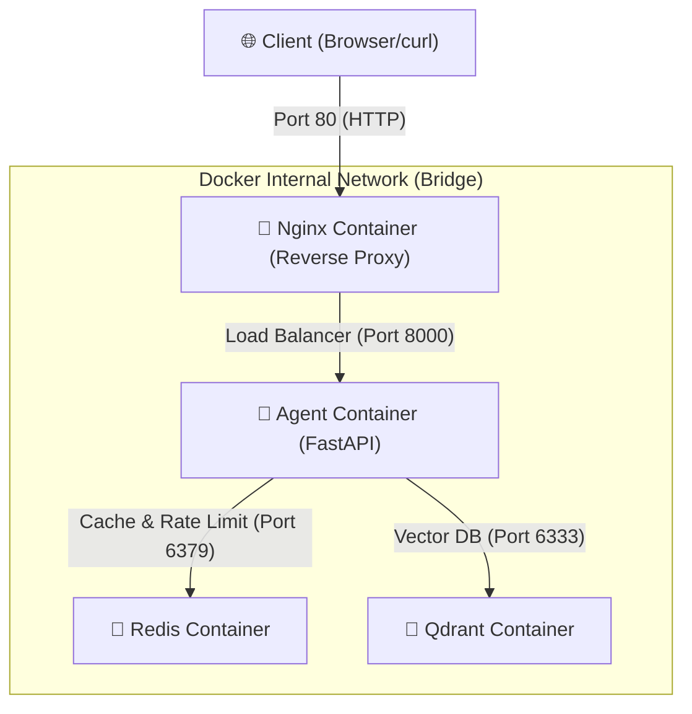

# Day 12 Lab - Mission Answers

## Part 1: Localhost vs Production

### Exercise 1.1: Anti-patterns found
1. **API key hardcode:** Chuỗi `sk-hardcoded-fake-key-never-do-this` bị ghi cứng trong mã nguồn, dễ bị lộ khi push lên GitHub.
2. **Database URL hardcode:** Chuỗi kết nối DB postgresql bị lộ tài khoản/mật khẩu trực tiếp trong code.
3. **Không có Config Management:** Biến `DEBUG` và `MAX_TOKENS` bị ghi cứng thay vì đọc từ biến môi trường.
4. **Sử dụng print() thay vì Logging:** Lệnh `print` ghi đè giá trị nhạy cảm (API key) ra đầu ra tiêu chuẩn, khó phân tích tự động.
5. **Host/Port cố định:** Gán cứng `localhost` và port `8000` khiến ứng dụng không thể chạy trong Docker hay các nền tảng Cloud (vốn cần lắng nghe ở `0.0.0.0` và cổng động do Cloud cấp).

### Exercise 1.3: Comparison table
| Feature | Develop (Basic) | Production (Advanced) | Why Important? |
|---------|---------|------------|----------------|
| Config  | Hardcode | Env vars | Bảo mật thông tin nhạy cảm, dễ cấu hình động giữa các môi trường dev/staging/prod mà không cần đổi code. |
| Health Check | Không có | Có `/health`, `/ready` | Giúp Cloud Platform kiểm soát trạng thái container (liveness probe) để tự động restart khi treo, hoặc điều phối traffic (readiness probe) chính xác. |
| Logging | print() | JSON structured | Dễ phân tích tự động bằng các công cụ thu thập log tập trung (Datadog, Loki), bảo mật tránh log nhạy cảm. |
| Shutdown | Đột ngột | Graceful | Cho phép hoàn thành nốt các request đang xử lý (in-flight requests) và đóng các kết nối DB an toàn trước khi tắt. |

---

## Part 2: Docker

### Exercise 2.1: Dockerfile questions
1. **Base image:** `python:3.11` (Bản phân phối Python đầy đủ, dung lượng lớn ~1GB+).
2. **Working directory:** `/app` (Thư mục làm việc mặc định trong container).
3. **Tại sao COPY requirements.txt trước:** Để tận dụng cơ chế Docker layer caching. Lệnh cài đặt thư viện (`pip install`) rất tốn thời gian, việc copy riêng file này trước giúp Docker cached lại layer này. Khi chỉ sửa code (`app.py`), Docker sẽ bỏ qua bước cài đặt thư viện.
4. **CMD vs ENTRYPOINT:** `ENTRYPOINT` định nghĩa câu lệnh chính cố định chạy khi khởi động container, còn `CMD` định nghĩa tham số mặc định truyền vào và có thể bị ghi đè dễ dàng khi chạy container (`docker run`).

### Exercise 2.3: Image size comparison
- **Develop:** 1.66 GB
- **Production:** 236 MB
- **Difference:** Giảm khoảng **85.7%** dung lượng.
- **Lý do:** Bản Production dùng base image `python:3.11-slim` (lược bỏ các gói OS không cần thiết) và áp dụng **Multi-stage Build** để để lại toàn bộ công cụ build (`gcc`, `libpq-dev`, cache của `pip`) ở Stage 1 (Builder), chỉ copy các file biên dịch cuối cùng sang Stage 2 (Runtime).

### Exercise 2.4: Architecture Diagram & Communication

* **Các service khởi động:** `nginx`, `agent`, `redis`, `qdrant`.
* **Giao tiếp:** Tất cả các container cùng nằm trong mạng bridge `internal` cô lập. Chỉ duy nhất `nginx` mở cổng `80` ra ngoài máy host để tiếp nhận request. Nginx áp dụng rate limit và phân phối các requests qua `agent:8000`. Agent kết nối tới `redis` và `qdrant` trong mạng nội bộ.

---

## Part 3: Cloud Deployment

### Exercise 3.1: Railway deployment
- **URL:** `https://day12ha-tang-cloudvadeployment-production-84af.up.railway.app`
- **Screenshots:**
  - [Deployment dashboard](screenshots/Deployment%20dashboard.png)
  - [Service running](screenshots/Service%20running.png)
  - [Test results](screenshots/Test%20results.png)

### Exercise 3.2: Deploy Render
- **So sánh `render.yaml` và `railway.toml`:**
  - `railway.toml` cấu hình cho một Service đơn lẻ chạy cục bộ (start command, health check, build mode).
  - `render.yaml` là file cấu hình Infrastructure as Code (IaC) để định nghĩa toàn bộ kiến trúc hạ tầng lớn đa dịch vụ (Multi-services) cùng lúc gồm Web service, Redis, Database, Auto-scaling, ổ đĩa lưu trữ và cấu hình liên kết biến môi trường.

---

## Part 4: API Security

### Exercise 4.1: API Key authentication
- **API key được check ở đâu:** Trong dependency `verify_api_key` gắn vào route `@app.post("/ask")`.
- **Nếu sai/thiếu key:** Trả về lỗi `401 Unauthorized` (nếu thiếu) và `403 Forbidden` (nếu sai).
- **Cách rotate key:** Thay đổi giá trị biến môi trường `AGENT_API_KEY` trong file cấu hình `.env.local` hoặc trên Dashboard của Cloud Provider mà không cần sửa code hay rebuild image.

### Exercise 4.2-4.3: Test results
- Thuật toán giới hạn: **Sliding Window Counter** bằng cách lưu timestamps của request vào `deque`.
- Giới hạn: **10 req/min** cho User thường (`student`) và **100 req/min** cho Admin (`teacher`).
- Bypass limit cho admin: Giải mã token JWT lấy thông tin `role`. Nếu `user["role"] == "admin"`, hệ thống áp dụng đối tượng `rate_limiter_admin` thay cho `rate_limiter_user`.

### Exercise 4.4: Cost guard implementation
- Sử dụng class `CostGuard` trong `cost_guard.py` để tính toán chi phí token sử dụng của mỗi user hàng ngày theo công thức: `cost = (input_tokens / 1000) * Input_Price + (output_tokens / 1000) * Output_Price`. Hệ thống sẽ lưu trữ và cộng dồn chi phí này trong ngày, tự động chặn người dùng bằng mã lỗi `402 Payment Required` nếu vượt quá ngân sách hàng ngày (`daily_budget_usd`).

---

## Part 5: Scaling & Reliability

### Exercise 5.1-5.5: Implementation notes
- **Health Checks:** Triển khai endpoint `/health` (Liveness) và `/ready` (Readiness) để nền tảng Cloud giám sát và tự động restart container khi lỗi, hoặc ngắt traffic khi chưa kết nối thành công DB/Redis.
- **Graceful Shutdown:** Lắng nghe tín hiệu `SIGTERM` từ container orchestrator, dừng tiếp nhận kết nối mới, xử lý nốt các request đang chạy (in-flight requests) và đóng kết nối cơ sở dữ liệu trước khi thoát.
- **Stateless Design:** Chuyển bộ lưu trữ conversation history từ bộ nhớ RAM của container sang **Redis**. Khi scale ra nhiều instances (replicas) qua Nginx load balancer, dữ liệu của người dùng vẫn được duy trì đồng nhất dù request được gửi tới bất kỳ instance nào.
